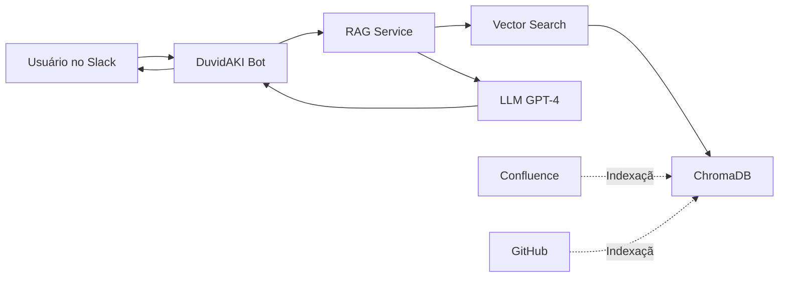

# DuvidAKI 🤖

<div align="center">

**Chatbot inteligente com RAG para Slack**

Responda dúvidas da equipe automaticamente com base em documentação do Confluence e GitHub

[](https://www.python.org/downloads/)
[](https://openai.com/)
[](https://slack.com/)
[](LICENSE)

</div>

---

## 📋 Índice

- [Sobre](#-sobre)
- [Características](#-características)
- [Como Funciona](#-como-funciona)
- [Requisitos](#-requisitos)
- [Instalação](#-instalação)
- [Configuração](#-configuração)
- [Uso](#-uso)
- [Deploy](#-deploy)
- [Custos](#-custos)
- [Troubleshooting](#-troubleshooting)
- [Contribuindo](#-contribuindo)

---

## 🎯 Sobre

**DuvidAKI** é um chatbot inteligente que utiliza **RAG (Retrieval Augmented Generation)** para responder perguntas da equipe baseadas em:
- 📚 Documentação do Confluence
- 💻 READMEs e docs de repositórios GitHub
- 🔍 Busca semântica com ChromaDB
- 🤖 Respostas geradas com GPT-4

Integrado nativamente ao **Slack**, permite que sua equipe tire dúvidas rapidamente sem sair da conversa.

---

## ✨ Características

### 🧠 Inteligência RAG
- **Busca Semântica**: Encontra informações relevantes mesmo com perguntas diferentes
- **Contexto Preciso**: Recupera os documentos mais relevantes antes de gerar a resposta
- **Embeddings OpenAI**: Usa text-embedding-3-small para representações vetoriais

### 📖 Múltiplas Fontes
- **Confluence**: Indexa espaços completos do Confluence automaticamente
- **GitHub**: Extrai READMEs, documentação e issues de repositórios
- **Extensível**: Fácil adicionar novos crawlers para outras fontes

### 💬 Integração Slack
- **@Mentions**: `@DuvidAKI como fazer deploy?`
- **Direct Messages**: Converse diretamente com o bot
- **Slash Commands**: `/duvidaki` e `/duvidaki-stats`
- **Threads**: Mantém conversas organizadas

### ⚡ Performance
- **ChromaDB**: Vector store local de alta performance
- **Chunking Inteligente**: Divide documentos em partes otimizadas
- **Cache de Embeddings**: Evita reprocessamento desnecessário

---

## 🔄 Como Funciona



### 1️⃣ Indexação (Executar 1x ou periodicamente)
```
Confluence/GitHub → Crawlers → Chunks → Embeddings → ChromaDB
```
- Crawlers extraem conteúdo das fontes
- Documentos são divididos em chunks de ~1000 caracteres
- OpenAI gera embeddings (vetores) para cada chunk
- ChromaDB armazena os vetores para busca rápida

### 2️⃣ Consulta (Cada pergunta do usuário)
```
Pergunta → Embedding → Busca Semântica → Top 5 Docs → GPT-4 → Resposta
```
- Pergunta é convertida em embedding
- ChromaDB busca os 5 chunks mais similares
- GPT-4 gera resposta baseada nesses chunks
- Resposta é enviada ao Slack com citação das fontes

---

## 📦 Requisitos

### Obrigatório
- **Python 3.9+**
- **OpenAI API Key** - [Obter aqui](https://platform.openai.com/api-keys)

### Opcional (dependendo do uso)
- **Slack App** - Para integração com Slack
- **Confluence API Token** - Para indexar Confluence
- **GitHub Token** - Para indexar repositórios GitHub

---

## 🚀 Instalação

### 1. Clone o repositório

```bash
git clone https://github.com/diasz12/chatbot-duvidAKI.git
cd chatbot-duvidAKI
```

### 2. Crie ambiente virtual

```bash
# Linux/Mac
python -m venv venv
source venv/bin/activate

# Windows
python -m venv venv
venv\Scripts\activate
```

### 3. Instale dependências

```bash
pip install -r requirements.txt
```

### 4. Configure variáveis de ambiente

```bash
# Copie o exemplo
cp .env.example .env

# Edite o .env com suas credenciais
nano .env  # ou vim, code, notepad, etc.
```

**Exemplo de `.env`:**

```env
# OpenAI (OBRIGATÓRIO)
OPENAI_API_KEY=sk-proj-...
OPENAI_MODEL=gpt-4o-mini
EMBEDDING_MODEL=text-embedding-3-small

# Slack (OBRIGATÓRIO para usar o bot no Slack)
SLACK_BOT_TOKEN=xoxb-...
SLACK_APP_TOKEN=xapp-...
SLACK_SIGNING_SECRET=...

# Confluence (OPCIONAL - se quiser indexar Confluence)
CONFLUENCE_URL=https://sua-empresa.atlassian.net
CONFLUENCE_EMAIL=seu-email@empresa.com
CONFLUENCE_API_TOKEN=ATATT3xFfGF0...
CONFLUENCE_SPACE_KEY=DOCS

# GitHub (OPCIONAL - se quiser indexar GitHub)
GITHUB_TOKEN=ghp_...
GITHUB_REPOS=empresa/backend,empresa/frontend

# Configurações Avançadas (opcional)
CHROMA_PERSIST_DIRECTORY=./data/chroma
MAX_RESULTS=5
CHUNK_SIZE=1000
CHUNK_OVERLAP=200
LOG_LEVEL=INFO
```

---

## ⚙️ Configuração

<details>
<summary><b>📱 Configurar Slack App</b></summary>

### 1. Criar App no Slack

1. Acesse [api.slack.com/apps](https://api.slack.com/apps)
2. Clique em **"Create New App"** → **"From scratch"**
3. Nome: `DuvidAKI`
4. Selecione seu workspace

### 2. Bot Token Scopes

Vá em **OAuth & Permissions** → **Scopes** e adicione:

**Bot Token Scopes:**
```
app_mentions:read
channels:history
chat:write
commands
im:history
im:read
im:write
```

### 3. Habilitar Socket Mode

1. **Socket Mode** → Habilitar
2. Criar **App-Level Token**:
   - Nome: `socket-token`
   - Scope: `connections:write`
3. Copiar token (começa com `xapp-`)

### 4. Event Subscriptions

**Event Subscriptions** → Habilitar → **Subscribe to bot events:**
```
app_mention
message.im
```

### 5. Slash Commands

Criar em **Slash Commands**:

| Command | Description |
|---------|-------------|
| `/duvidaki` | Fazer uma pergunta ao DuvidAKI |
| `/duvidaki-stats` | Ver estatísticas da base de conhecimento |

### 6. Instalar no Workspace

1. **OAuth & Permissions** → **Install to Workspace**
2. Copiar **Bot User OAuth Token** (começa com `xoxb-`)

### 7. Copiar Signing Secret

**Basic Information** → **App Credentials** → Copiar **Signing Secret**

✅ Pronto! Adicione os tokens no `.env`

</details>

<details>
<summary><b>📚 Configurar Confluence</b></summary>

### Gerar API Token

1. Acesse [id.atlassian.com/manage-profile/security/api-tokens](https://id.atlassian.com/manage-profile/security/api-tokens)
2. Clique em **"Create API token"**
3. Nome: `DuvidAKI`
4. Copiar token gerado

### Configurar no .env

```env
CONFLUENCE_URL=https://sua-empresa.atlassian.net
CONFLUENCE_EMAIL=seu-email@empresa.com
CONFLUENCE_API_TOKEN=ATATT3xFfGF0...
CONFLUENCE_SPACE_KEY=DOCS  # Chave do espaço a indexar
```

</details>

<details>
<summary><b>💻 Configurar GitHub</b></summary>

### Gerar Personal Access Token

1. Acesse [github.com/settings/tokens](https://github.com/settings/tokens)
2. **Generate new token** → **Classic**
3. Scopes:
   - `repo` (repositórios privados)
   - OU `public_repo` (apenas públicos)
4. Copiar token gerado

### Configurar no .env

```env
GITHUB_TOKEN=ghp_...
GITHUB_REPOS=empresa/repo1,empresa/repo2,usuario/repo3
```

</details>

---

## 💻 Uso

### 📥 1. Indexar Base de Conhecimento

```bash
# Indexar apenas Confluence
python main.py index --confluence

# Indexar apenas GitHub
python main.py index --github

# Indexar tudo
python main.py index --all
```

**Exemplo de saída:**
```
2025-12-08 10:30:00 - INFO - Starting knowledge base indexing...
2025-12-08 10:30:05 - INFO - Crawled 455 pages from Confluence space 'DOCS'
2025-12-08 10:30:10 - INFO - Processed 455 documents into 2296 chunks
2025-12-08 10:45:30 - INFO - Added 2296 documents to vector store
✅ Confluence indexed successfully

📊 Knowledge Base Stats:
   Total documents: 2296
```

### 🤖 2. Iniciar Bot Slack

```bash
python main.py start
```

O bot ficará online no Slack e responderá perguntas automaticamente.

### 🧪 3. Testar Queries Localmente

```bash
python main.py query "Como fazer deploy em produção?"
```

**Exemplo de saída:**
```
Question: Como fazer deploy em produção?

Response:
Para fazer deploy em produção, siga estes passos:

1. **Build da Aplicação**
   - Execute `npm run build` para gerar os arquivos otimizados

2. **Configuração do Servidor**
   - Configure as variáveis de ambiente em `.env.production`
   - Certifique-se que o banco de dados está configurado

3. **Deploy**
   - Use Docker: `docker-compose -f docker-compose.prod.yml up -d`
   - Ou PM2: `pm2 start ecosystem.config.js --env production`

Fontes:
- [Confluence] Guia de Deploy (https://empresa.atlassian.net/wiki/...)
- [GitHub] README.md - backend (https://github.com/empresa/backend/...)
```

### 📊 4. Ver Estatísticas

```bash
python main.py stats
```

**Exemplo de saída:**
```
📊 DuvidAKI Statistics
==================================================
Total documents: 2296
Confluence: ✅ Configured
GitHub: ✅ Configured
==================================================
```

### 🗑️ 5. Resetar Base de Conhecimento

```bash
python main.py reset
```

⚠️ Isso apaga todos os documentos indexados. Você precisará reindexar depois.

---

## 💬 Usando no Slack

### Método 1: Mencionar o Bot

```
@DuvidAKI Como funciona o processo de CI/CD?
```

### Método 2: Direct Message

Envie uma DM ao bot:
```
Qual a política de backup dos dados?
```

### Método 3: Slash Command

```
/duvidaki Como configurar variáveis de ambiente?
```

### Ver Estatísticas

```
/duvidaki-stats
```

---

## 🏗️ Estrutura do Projeto

```
chatbot-duvidAKI/
├── 📄 main.py                    # Entry point - CLI principal
├── 📄 requirements.txt           # Dependências Python
├── 📄 .env.example              # Exemplo de configuração
├── 📄 README.md                 # Esta documentação
│
├── 📁 src/
│   ├── 📄 config.py             # Configurações centralizadas
│   │
│   ├── 📁 crawlers/             # Extração de dados
│   │   ├── confluence_crawler.py  # Confluence API
│   │   └── github_crawler.py      # GitHub API
│   │
│   ├── 📁 services/             # Lógica de negócio
│   │   ├── vector_store.py        # ChromaDB + Embeddings
│   │   ├── document_processor.py  # Chunking de documentos
│   │   └── rag_service.py         # RAG completo
│   │
│   ├── 📁 integrations/         # Integrações externas
│   │   └── slack_bot.py           # Slack Bolt SDK
│   │
│   └── 📁 utils/
│       └── logger.py              # Logging configurado
│
├── 📁 data/
│   └── chroma/                   # ChromaDB persistence
│
└── 📁 tests/                     # Testes (futuros)
```

---

## 🚢 Deploy

### Opção 1: Servidor VPS/Cloud

```bash
# 1. Clone no servidor
git clone https://github.com/diasz12/chatbot-duvidAKI.git
cd chatbot-duvidAKI

# 2. Configure ambiente
python -m venv venv
source venv/bin/activate
pip install -r requirements.txt

# 3. Configure .env com suas credenciais

# 4. Indexe a base de conhecimento
python main.py index --all

# 5. Use PM2 para manter rodando
npm install -g pm2
pm2 start "python main.py start" --name duvidaki
pm2 save
pm2 startup
```

### Opção 2: Docker

**Dockerfile:**
```dockerfile
FROM python:3.11-slim

WORKDIR /app

COPY requirements.txt .
RUN pip install --no-cache-dir -r requirements.txt

COPY . .

CMD ["python", "main.py", "start"]
```

**docker-compose.yml:**
```yaml
version: '3.8'

services:
  duvidaki:
    build: .
    container_name: duvidaki-bot
    restart: unless-stopped
    env_file:
      - .env
    volumes:
      - ./data:/app/data
```

**Executar:**
```bash
docker-compose up -d
```

### Opção 3: Heroku

```bash
# 1. Login no Heroku
heroku login

# 2. Criar app
heroku create duvidaki-bot

# 3. Configurar variáveis
heroku config:set OPENAI_API_KEY=sk-...
heroku config:set SLACK_BOT_TOKEN=xoxb-...
# ... outras variáveis

# 4. Deploy
git push heroku main

# 5. Indexar base de conhecimento
heroku run python main.py index --all

# 6. Iniciar worker
heroku ps:scale worker=1
```

---

## 💰 Custos Estimados

### OpenAI API

| Serviço | Modelo | Preço |
|---------|--------|-------|
| **Embeddings** | text-embedding-3-small | $0.02 / 1M tokens |
| **Chat** | gpt-4o-mini | $0.15 / 1M tokens (input)<br>$0.60 / 1M tokens (output) |

**Estimativa para 1000 documentos:**
- **Indexação inicial**: ~$1-2 (única vez)
- **Consultas**: ~$0.01-0.05 por pergunta
- **Mensal (100 perguntas/dia)**: ~$30-150

### Infraestrutura

- ✅ **ChromaDB**: Gratuito (local)
- ✅ **Slack**: Gratuito
- ✅ **Confluence/GitHub**: Já existente
- 💵 **Servidor VPS**: $5-20/mês (DigitalOcean, AWS, etc.)

---

## 🔧 Manutenção

### Reindexação Automática

Configure um cron job para reindexar diariamente:

```bash
# Editar crontab
crontab -e

# Adicionar linha (reindexar às 2h da manhã)
0 2 * * * cd /path/to/chatbot-duvidAKI && /path/to/venv/bin/python main.py index --all
```

### Monitoramento

```bash
# Ver logs em tempo real
tail -f logs/app.log

# Com PM2
pm2 logs duvidaki

# Com Docker
docker logs -f duvidaki-bot
```

---

## 🐛 Troubleshooting

<details>
<summary><b>❌ Erro: "Slack not configured"</b></summary>

**Causa**: Variáveis do Slack não configuradas no `.env`

**Solução**:
```bash
# Verifique se tem todas as variáveis:
cat .env | grep SLACK

# Devem aparecer:
SLACK_BOT_TOKEN=xoxb-...
SLACK_APP_TOKEN=xapp-...
SLACK_SIGNING_SECRET=...
```
</details>

<details>
<summary><b>❌ Erro: "OpenAI API error"</b></summary>

**Possíveis causas:**
1. API Key inválida
2. Sem créditos na conta OpenAI
3. Rate limit excedido

**Soluções:**
```bash
# 1. Verificar API key
echo $OPENAI_API_KEY

# 2. Testar API key
curl https://api.openai.com/v1/models \
  -H "Authorization: Bearer $OPENAI_API_KEY"

# 3. Verificar créditos em:
# https://platform.openai.com/account/usage
```
</details>

<details>
<summary><b>❌ Bot não responde no Slack</b></summary>

**Checklist:**
- [ ] Bot está rodando (`python main.py start`)
- [ ] Base indexada (`python main.py stats` mostra documentos > 0)
- [ ] Bot foi adicionado ao canal do Slack
- [ ] Permissões corretas configuradas
- [ ] Socket Mode habilitado
- [ ] Tokens corretos no `.env`

**Debug:**
```bash
# Ver logs
tail -f logs/app.log

# Testar localmente primeiro
python main.py query "teste"
```
</details>

<details>
<summary><b>❌ Erro: "no such column: collections.topic"</b></summary>

**Causa**: Banco ChromaDB corrompido ou versão incompatível

**Solução**:
```bash
# Deletar banco antigo
rm -rf data/chroma

# Reindexar
python main.py index --all
```
</details>

---

## 🤝 Contribuindo

Contribuições são bem-vindas! Para contribuir:

1. **Fork** o projeto
2. **Crie uma branch** para sua feature (`git checkout -b feature/NovaFeature`)
3. **Commit** suas mudanças (`git commit -m 'Add: nova feature incrível'`)
4. **Push** para a branch (`git push origin feature/NovaFeature`)
5. Abra um **Pull Request**

### Roadmap

- [ ] Suporte para mais fontes (Notion, Google Docs)
- [ ] Interface web para gerenciamento
- [ ] Multi-idioma
- [ ] Analytics de perguntas mais frequentes
- [ ] Cache de respostas comuns
- [ ] Fine-tuning do modelo

---

## 📄 Licença

Este projeto está sob a licença MIT. Veja o arquivo [LICENSE](LICENSE) para mais detalhes.

---

## 📞 Contato & Suporte

- 🐛 **Issues**: [GitHub Issues](https://github.com/diasz12/chatbot-duvidAKI/issues)
- 💬 **Discussões**: [GitHub Discussions](https://github.com/diasz12/chatbot-duvidAKI/discussions)
- 📧 **Email**: suporte@exemplo.com

---

<div align="center">

**Feito com ❤️ para facilitar o compartilhamento de conhecimento**

⭐ Se este projeto foi útil, considere dar uma estrela!

</div>
